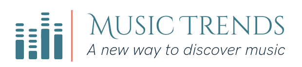

# Music Trends --- Project of Data Visualization (COM-480)

## Setup and usage
This might be simplified using a service such as Netlify eventually.

The following is meant to be done in the terminal.
You should have some browser as well as `python3` installed.
1. Clone this repository where you want:
`git clone https://github.com/com-480-data-visualization/data-visualization-project-2021-vizbrains`
2. `cd` into the directory root (containing `index.html`) and run `python3 -m http.server`; copy the given url
3. Paste the url in the browser and enjoy! 

## Motivations
| Student's name | SCIPER |
| -------------- | ------ |
| Auguste Baum   | 322935 |
| Yanis Berkani  | 271348 |
| Clément Petit  | 282626 |

As three real music enthusiasts, we've always wanted to learn more and
do some scientific research in the music domain. Accordingly, the
dataset we chose is a collection of music data from a [Kaggle competition](https://www.kaggle.com/yamaerenay/spotify-dataset-19212020-160k-tracks).

More precisely, the data consists of music features for about 600 000
tracks and 1.1 million artists from the Spotify streaming service,
spanning 100 years (from 1922 to 2021). The data are divided into 2 main
datasets:

-   **Tracks:** name, date of release, popularity, duration, energy,
    tempo...

-   **Artists:** name, followers, popularity, genres.

You can find out a lot more details about the features in our
`EDA.ipynb` notebook (works best on Firefox).

## Milestone 1 (23rd April, 5pm)

**10% of the final grade**

[Milestone 1 PDF](milestones/milestone1.pdf) • [Milestone 1 MD](milestones/milestone1.md)

## Milestone 2 (7th May, 5pm)

**10% of the final grade**

[Milestone 2 PDF](milestones/milestone2.pdf) • [Milestone 2 MD](milestones/milestone2.md)

## Milestone 3 (4th June, 5pm)

**80% of the final grade**

[Milestone 3 PDF](milestones/milestone3.pdf) • [Milestone 3 MD](milestones/milestone3.md)

